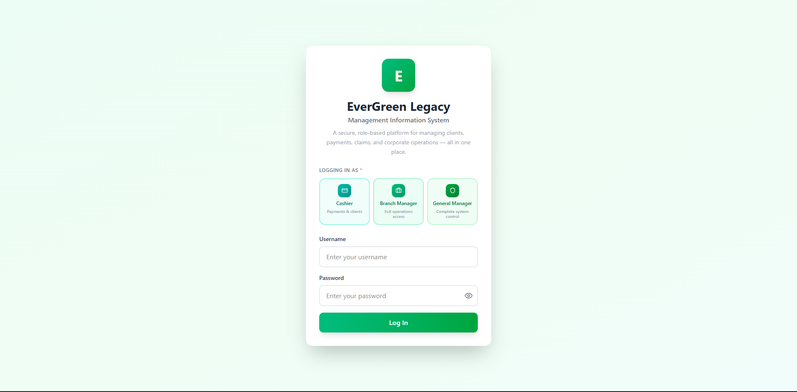
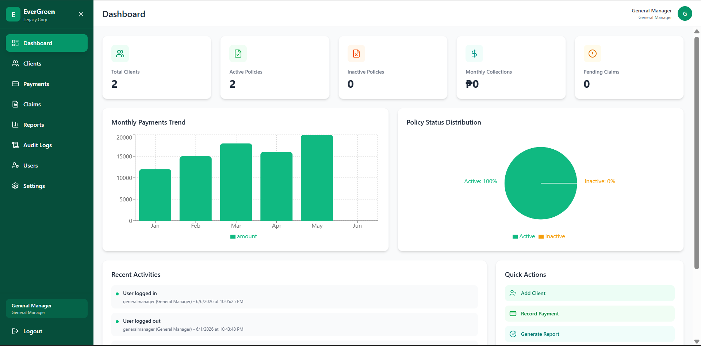

# Hi, I'm Vynch 👋

## About Me
BS Information Systems student focused on:

- Prompt Engineering
- AI Workflow Design
- Business Process Modeling

## Featured Project

System Analysis and Design a Management System for EverGreen Legacy Corp

###### What is EverGreen Legacy Corp?

EverGreen Legacy Corp is a Philippine-based insurance and financial services company offering life, legacy, and preneed plans for Filipino families. It operates through branches managed by Branch Managers, with Cashiers handling client transactions and a General Manager overseeing the entire organization.

###### EverGreen Login Page

###### What is the purpose of the system?

The EverGreen Legacy Corp Management System is a centralized digital platform built to streamline and modernize the company's daily operations, replacing manual, paper-based processes with an efficient, transparent, and accountable system for managing clients, policies, payments, and claims across all branches.

###### EverGreen Dashboard

Special credits to **Reuben Juen** and **Greg Ramos** as my teammates, for their dedication, collaboration, and invaluable
contributions to the successful development of the entire system.

## Tools
- ChatGPT
- Claude
- Canva

## Connect
Portfolio: https://vynchpf.my.canva.site
